<<<<<<< HEAD
=======
[README_Bacterial_RNA_Analysis_v30_with_screenshots.md](https://github.com/user-attachments/files/32361121/README_Bacterial_RNA_Analysis_v30_with_screenshots.md)
>>>>>>> a6c5657728ca3ddb3d58c91aee68aec4e715ed7c
# Bacterial RNA Analysis

**Version 1.9.77 v30**

Bacterial RNA Analysis is a Windows desktop suite for bacterial RNA sequencing analysis. It integrates RNA-seq preprocessing, differential expression, functional enrichment and pathways, co-expression and network analysis, and operon or transcription-unit prediction in one graphical workflow.

The application is designed for researchers who want a guided interface while still retaining access to the underlying biological inputs, parameters, commands, statistics, result tables, and interactive visualizations.

> **Platform:** 64-bit Windows 10 or Windows 11  
> **Linux execution layer:** WSL2 with Ubuntu  
> **Release:** 1.9.77 v30  
> **Status:** Research software

---

## Contents

- [Download](#download)
- [Overview](#overview)
- [Main modules](#main-modules)
- [Analysis workflow](#analysis-workflow)
- [System requirements](#system-requirements)
- [Installation](#installation)
- [Quick start](#quick-start)
- [1. RNA-seq processing](#1-rna-seq-processing)
- [2. Differential expression](#2-differential-expression)
- [3. GO, enrichment and pathways](#3-go-enrichment-and-pathways)
- [4. Co-expression and networks](#4-co-expression-and-networks)
- [5. Operons and transcription units](#5-operons-and-transcription-units)
- [Interactive visualization](#interactive-visualization)
- [Input files](#input-files)
- [Output files](#output-files)
- [Reproducibility and provenance](#reproducibility-and-provenance)
- [Project structure](#project-structure)
- [Troubleshooting](#troubleshooting)
- [Known limitations](#known-limitations)
- [Development and testing](#development-and-testing)
- [Third-party software and databases](#third-party-software-and-databases)
- [Citation](#citation)
- [License](#license)
- [Contributing](#contributing)
- [Research-use disclaimer](#research-use-disclaimer)

---

## Download

For normal use, download the newest complete release archive from the **Releases** section of this GitHub repository.

Recommended release asset name:

```text
Bacterial_RNA_Analysis_1.9.77_v30.zip
```

After downloading:

1. Extract the **entire ZIP archive** to a normal writable folder.
2. Do not run the program from inside the compressed ZIP.
3. Keep `Bacterial RNA Analysis.exe` beside the `Application` folder.
4. Start the software with `Bacterial RNA Analysis.exe`.
5. Use the built-in environment setup or environment-check functions before the first analysis.

The executable is a launcher for the adjacent source tree. It is **not** a standalone executable containing the whole application. Moving the EXE away from `Application/` will break the expected layout.

A typical extracted release should look like:

```text
Bacterial RNA Analysis/
├── Bacterial RNA Analysis.exe
├── Application/
│   ├── App/
│   ├── Modules/
│   ├── Documentation/
│   ├── Examples/
│   └── Maintenance/
└── README.md
```

---

## Overview

Bacterial RNA Analysis is built around five integrated analysis modules:

1. **RNA-seq processing**
2. **Differential expression**
3. **GO, enrichment and pathways**
4. **Co-expression and networks**
5. **Operons and transcription units**

The suite combines a Windows graphical interface with Linux bioinformatics tools executed through WSL2. Downstream statistical analysis uses R and Python components, while interactive result exploration is provided through linked HTML and Plotly-based visualization interfaces.

### Main application interface

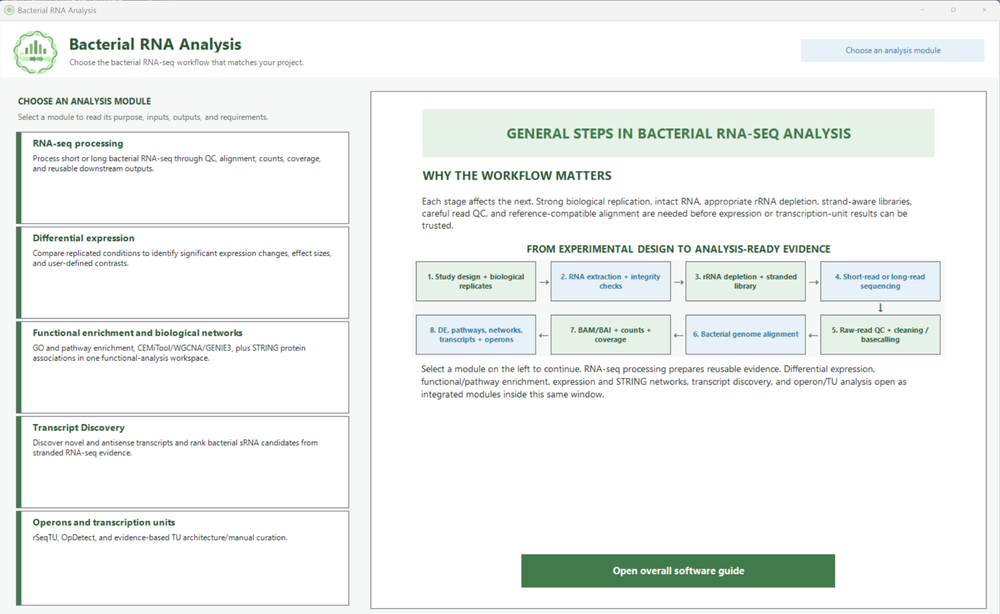

*Main application window for choosing an analysis workflow.*

The software emphasizes:

- guided analysis without hiding scientific parameters
- bacterial and prokaryotic RNA-seq workflows
- short-read and long-read preprocessing
- raw-count-based differential expression
- functional interpretation of DE results
- co-expression and regulatory-network exploration
- operon and transcription-unit prediction
- linked interactive plots and spreadsheets
- reproducible commands and run logs
- exportable analysis-ready files

---

## Main modules

| Module | Main purpose | Typical starting input |
|---|---|---|
| **RNA-seq processing** | QC, cleaning or basecalling, alignment, counting, coverage, and analysis-ready export | FASTQ, unaligned BAM, or ONT POD5 plus FASTA and GFF3/GTF |
| **Differential expression** | Compare replicated biological conditions | Raw integer count matrix plus sample metadata |
| **GO, enrichment and pathways** | Convert gene lists or rankings into functional biological themes | Differential-expression results or another ranked/selected gene set |
| **Co-expression and networks** | Identify expression modules, hubs, associations, and network relationships | Normalized expression matrix plus sample metadata |
| **Operons and transcription units** | Predict bacterial transcription units and operons | BAM for rSeqTU or raw short-read FASTQ for OpDetect |

---

## Analysis workflow

A common workflow is:

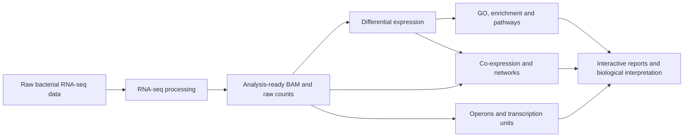

The modules can also be used independently when compatible external input files are already available.

---

## System requirements

### Required platform

- 64-bit **Windows 10 or Windows 11**
- **WSL2**
- an Ubuntu Linux distribution available through WSL
- Windows PowerShell
- sufficient RAM and disk space for the sequencing data being analyzed

### Internet access

Internet access is normally required for:

- first-time environment installation
- environment repair or package installation
- optional tool installation
- online annotation or database services
- KEGG or STRING-related online functions when enabled

Once the required environments and databases are available locally, many analyses can run without continuous internet access.

### Browser

Interactive HTML reports should be opened in a modern browser such as:

- Microsoft Edge
- Google Chrome
- Firefox

### Hardware

Required resources depend strongly on the number of samples, read depth, genome size, selected tools, and analysis module.

For **OpDetect**, the integrated documentation recommends at least:

- 16 GB RAM
- about 20 GB free disk space, in addition to space required for FASTQ, BAM, and result files

Larger projects may require substantially more storage.

---

## Installation

### Recommended installation

1. Download the complete v30 release ZIP from GitHub Releases.
2. Extract it to a writable local folder, for example:

```text
C:\Bacterial RNA Analysis\
```

or

```text
D:\Bioinformatics\Bacterial RNA Analysis\
```

3. Confirm that the root layout contains both:

```text
Bacterial RNA Analysis.exe
Application\
```

4. Double-click:

```text
Bacterial RNA Analysis.exe
```

5. Open **RNA-seq processing** and choose the required analysis type:

- Short reads
- Long reads
- Both

6. On the environment page, use:

```text
Install or repair core
```

7. When installation is complete, use:

```text
Check environment for read type
```

8. Optional accuracy-audit tools can be installed through:

```text
Install optional tools
```

9. Dorado is configured separately and is required only when processing raw Oxford Nanopore POD5 input.

### Important

Do not separate the root EXE from the `Application` directory.

The root executable loads:

```text
Application/App/rnaseq_gui.ps1
```

and the feature modules stored under `Application/Modules/`.

---

## Quick start

### Starting from raw RNA-seq reads

1. Open **RNA-seq processing**.
2. Choose Short reads, Long reads, or Both.
3. Select a bacterial reference FASTA.
4. Select the matching GFF3 or GTF annotation.
5. Add samples and biological metadata.
6. Check the Linux analysis environment.
7. Review or change the analysis methods.
8. Run the pipeline.
9. Review QC, BAM files, counts, coverage, logs, and reports.
10. Continue directly to Differential Expression when appropriate.

### Starting from an existing count matrix

1. Open **Differential expression**.
2. Import the raw integer gene-count matrix.
3. Import sample metadata.
4. Define the experimental design and contrasts.
5. Select edgeR, DESeq2, or limma-voom.
6. Run the analysis.
7. Explore the linked statistics, plots, and spreadsheets.
8. Send suitable results to functional enrichment or network analysis.

### Starting from an existing DE result

1. Open **GO, enrichment and pathways**.
2. Import the DE table or ranked gene list.
3. Provide or generate gene-to-term annotation.
4. Select ORA, ranked enrichment, or GO-aware analysis.
5. Run the analysis.
6. Explore enrichment plots, GO visualizations, pathway mappings, and linked tables.

---

# 1. RNA-seq processing

The RNA-seq processing module prepares bacterial sequencing data for downstream analysis.

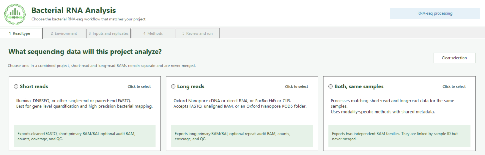

*RNA-seq Processing begins by selecting short reads, long reads, or a combined project.*

## Supported read types

### Short reads

- Illumina FASTQ
- DNBSEQ FASTQ
- single-end reads
- paired-end reads

### Long reads

- Oxford Nanopore FASTQ
- Oxford Nanopore unaligned BAM
- Oxford Nanopore POD5
- PacBio FASTQ
- supported PacBio long-read modes

### Combined projects

Short-read and long-read data can be analyzed in the same project while keeping their BAM families separate.

## Required project information

Typical inputs include:

- reference genome FASTA
- matching GFF3 or GTF annotation
- Sample ID
- biological condition
- replicate identifier
- sequencing read files
- optional batch information

For POD5 input, a compatible Dorado executable and chemistry-matched basecalling model are also required.

## Processing stages

Depending on selected methods, the pipeline can perform:

- input validation
- FASTQ quality control
- adapter and quality trimming
- ONT basecalling
- short-read alignment
- long-read alignment
- BAM sorting
- BAM indexing
- alignment QC
- library-strand auditing
- gene-level quantification
- coverage-track generation
- MultiQC aggregation
- analysis-ready export

## Available short-read methods

The suite includes options based on:

- FastQC
- fastp
- Cutadapt
- Bowtie2
- BWA-MEM2
- HISAT2
- SAMtools
- featureCounts
- HTSeq
- optional FADU auditing
- deepTools `bamCoverage`
- MultiQC

Accuracy-oriented workflows can use an alternative aligner as an independent audit rather than merging conflicting alignments.

## Available long-read methods

The suite includes options based on:

- Dorado for ONT POD5 basecalling
- NanoPlot
- LongQC
- Minimap2
- Winnowmap2
- SAMtools
- featureCounts long-read counting
- deepTools coverage generation

Dorado is optional when reads have already been basecalled.

## RNA-seq processing outputs

Depending on the selected workflow, results can include:

- cleaned FASTQ files
- newly basecalled FASTQ
- Dorado BAM
- coordinate-sorted BAM
- BAM indexes
- raw gene counts
- count summaries
- FADU audit output when selected and available
- raw coverage
- CPM-scaled coverage
- strand-specific coverage
- BigWig tracks
- bedGraph tracks
- reference files
- normalized annotation
- sample metadata
- alignment QC
- strand-orientation audit
- MultiQC report
- software versions
- executed commands
- configuration records
- file checksums

---

# 2. Differential expression

The Differential Expression module identifies genes whose abundance changes reproducibly between biological conditions.

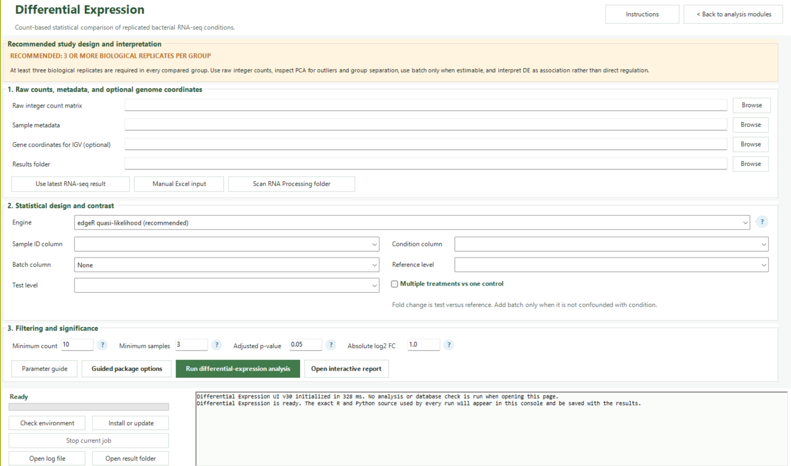

*Differential Expression setup showing count/metadata inputs, statistical design, filtering thresholds, and analysis controls.*

## Recommended input

Use:

- **raw integer gene counts**
- complete sample metadata
- biological replicate information
- experimental condition
- optional batch or other design covariates

Do not use TPM, FPKM, percentages, or already normalized expression values as count-based input to edgeR or DESeq2.

## Biological replication

The interface requires at least two biological replicates per group for standard replicated analysis.

Three or more biological replicates per condition are preferred whenever possible.

## Included R engines

### edgeR

The guided default uses edgeR quasi-likelihood methods for count-based differential expression.

Suitable for:

- replicated bacterial RNA-seq
- flexible designs
- strong control of biological variability
- efficient multi-contrast analysis

### DESeq2

Provides established negative-binomial modeling with dispersion estimation and shrinkage-based workflows.

### limma-voom

Useful for:

- multifactor designs
- larger sample collections
- many contrasts
- designs where a stable mean-variance relationship can be estimated

## DE analysis outputs

Depending on analysis settings, outputs can include:

- filtered counts
- normalized values for visualization
- complete DE statistics
- log fold changes
- p-values
- adjusted p-values
- diagnostic statistics
- contrast-specific tables
- advanced diagnostic plots
- interactive plots
- linked interactive spreadsheet
- inputs prepared for downstream enrichment and network modules
- complete command and code logs

## Interactive DE visualizations

v30 includes linked interactive views such as:

- volcano plot
- MA plot
- ranked differential-expression statistics
- expression distributions
- histogram and bar summaries
- sample-expression views
- single-gene expression explorer
- advanced DE diagnostic views
- generic linked-result visualization

### Example interactive DE views

**Volcano plot with linked spreadsheet**

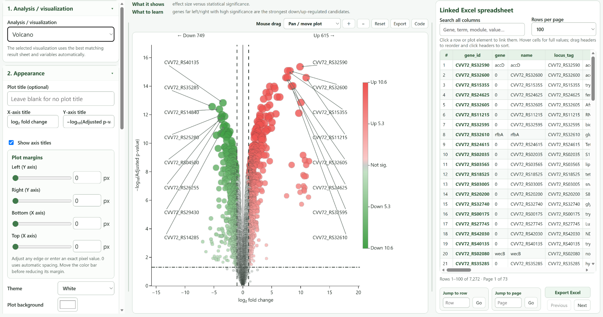

**MA plot**

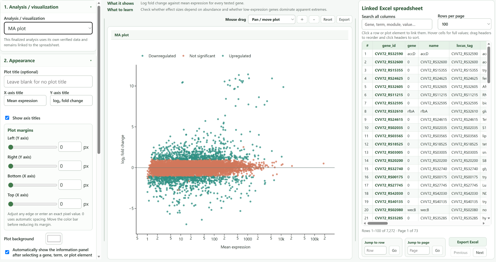

**Genome-region view**

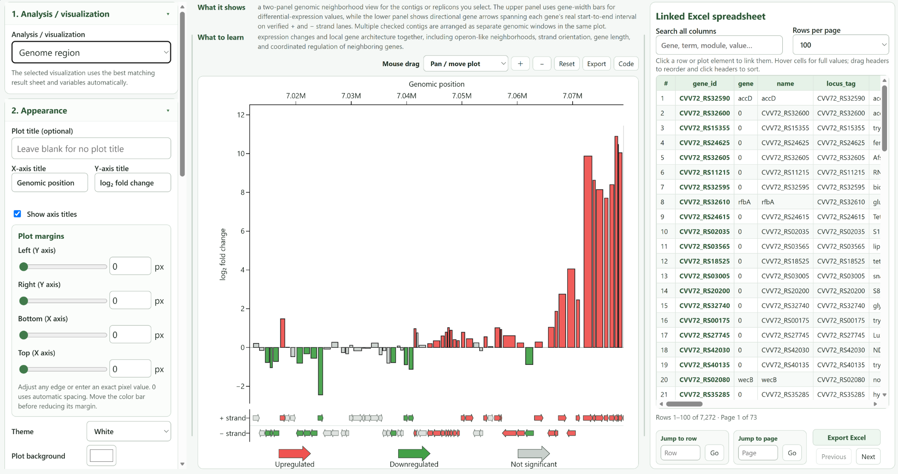

**Circos-style genomic view**

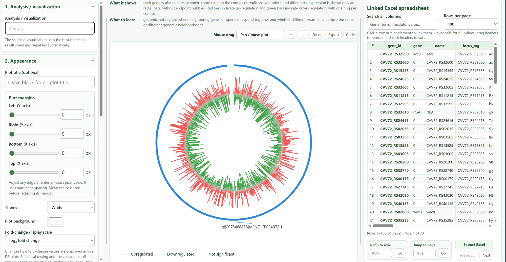

Each view remains linked to the interactive result spreadsheet, allowing genes selected in a plot or table to be inspected across compatible visualizations.


---

# 3. GO, enrichment and pathways

This module interprets significant or ranked genes through functional terms, biological processes, cellular components, pathways, and user-provided gene sets.

## Typical inputs

Use either:

- a thresholded gene list
- a full signed gene ranking
- a differential-expression result table
- another statistically appropriate gene-level result

A proper background or tested-gene universe should be supplied whenever possible.

## Annotation and mapping

The workflow supports gene-to-term mappings for resources such as:

- Gene Ontology
- KEGG
- COG
- eggNOG
- BioCyc-derived mappings
- regulons
- STRING-related categories
- custom gene sets

Availability depends on the selected organism, identifiers, local mapping files, and enabled online services.

## Included enrichment methods

### clusterProfiler ORA

Over-representation analysis for a selected set of genes.

### fgsea

Rank-based gene-set enrichment using a complete signed ranking.

### topGO

GO-aware analysis that considers the GO graph structure and can reduce broad redundancy when valid GO identifiers are available.

## Functional-analysis outputs

Outputs can include:

- enrichment result tables
- adjusted p-values
- contributing genes
- gene-to-term mappings
- universe/background reports
- annotation tables
- pathway mapping information
- interactive plots
- linked spreadsheets
- code and command logs

## Interactive functional visualizations

v30 supports interactive views including:

- enrichment bar plot
- enrichment dot plot
- RichFactor enrichment plot
- enrichment Circos-style summary
- enrichment term-overlap network
- gene-term network
- GO DAG focus and context
- GO annotation landscape
- GO semantic-similarity clusters
- bacterial cellular-component map
- generic linked-result plotting

The visualization environment includes linked table selection, appearance controls, editable plot settings, and export-oriented views.

### Example functional-analysis views

**GO DAG focus and context**

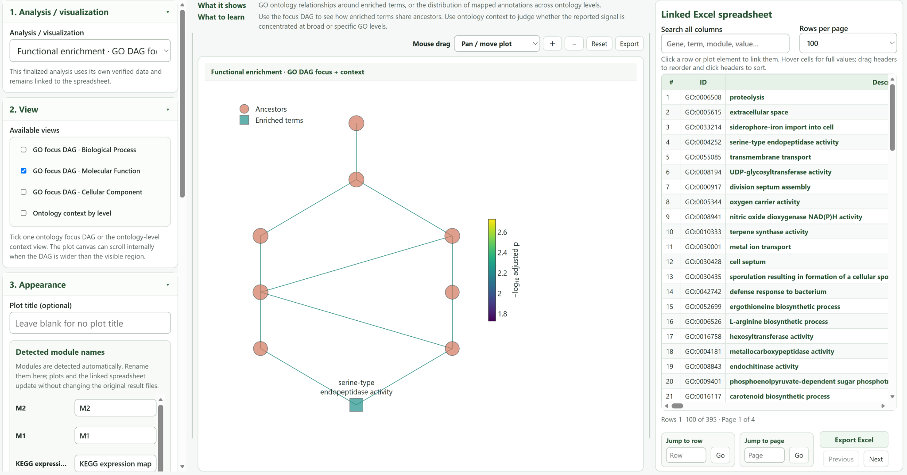

**Bacterial cellular-component map**

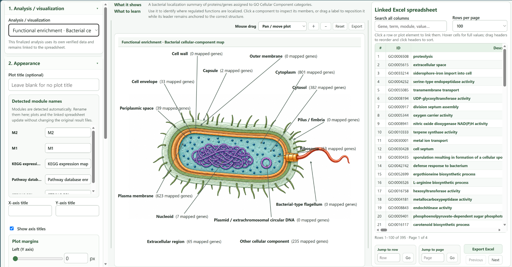

**RichFactor enrichment plot**

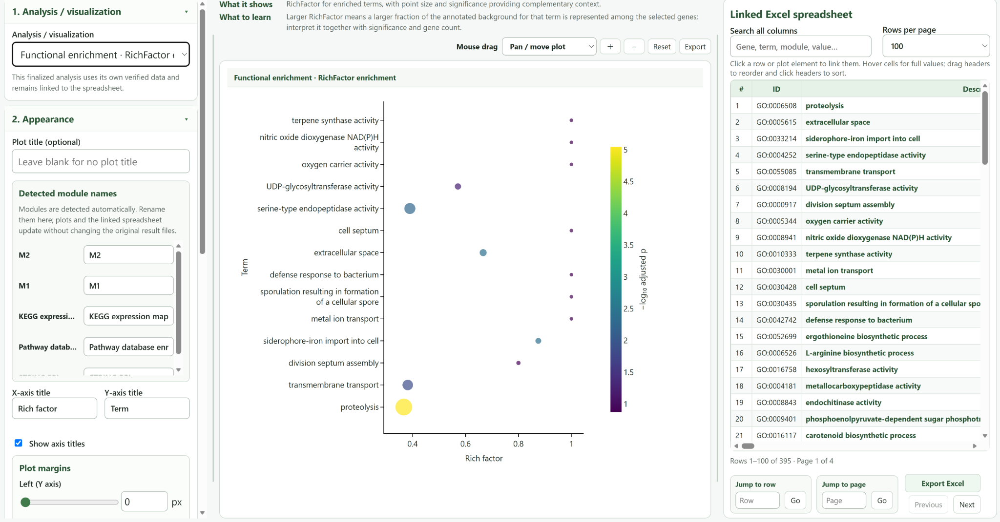

---

# 4. Co-expression and networks

The Co-expression and Networks module identifies genes with coordinated expression patterns across samples.

It is intended for discovering:

- co-expression modules
- module eigengenes
- module-trait relationships
- candidate hub genes
- gene-gene relationships
- regulatory hypotheses

## Input requirements

Use a normalized expression matrix from independent biological samples together with sample metadata.

The module is designed for broad filtered expression matrices rather than only a small list of significant DE genes.

Before network analysis, consider:

- batch effects
- sample outliers
- duplicate gene identifiers
- low-information genes
- sample independence

## Sample number

The guided interface expects at least 15 samples for standard co-expression analysis unless exploratory mode is enabled.

Twenty or more samples are preferable for more stable network estimation.

## Included engines

### CEMiTool

A guided automated module-discovery workflow.

### WGCNA

Provides detailed control over module construction and trait association, with greater sample and memory requirements.

### GENIE3

Ranks directed regulator-target hypotheses using tree-based inference and can be computationally intensive.

## Network outputs

Depending on the selected analysis, outputs can include:

- network modules
- module assignments
- eigengenes
- module-trait statistics
- hub-gene rankings
- node tables
- edge tables
- regulator-target hypotheses
- interactive network plots
- linked spreadsheets
- full command and code logs

## Interactive network views

Available v30 visualizations include:

- co-expression or regulatory gene network
- module-trait associations
- module eigengenes
- module-expression heatmap
- module-expression trends
- generic result-table plotting

### Example co-expression and network views

**Interactive gene network**

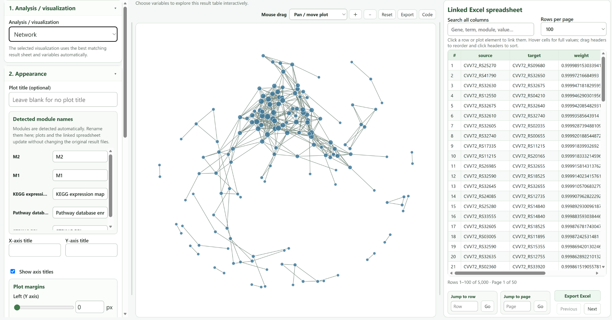

**Module-expression heatmap**

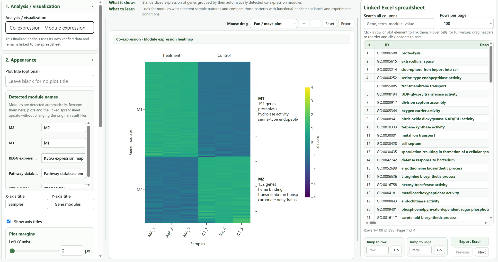

Where configured, integrated external database analysis can also connect network interpretation with resources such as STRING.

Network predictions are hypotheses and should be supported with independent biological evidence whenever possible.

---

# 5. Operons and transcription units

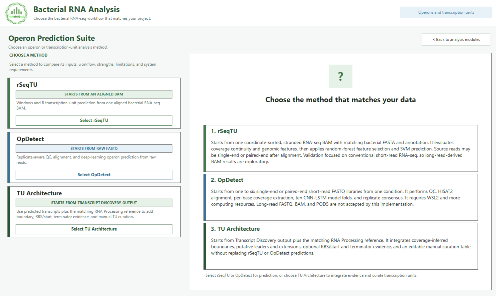

*Operon Prediction Suite showing the available transcription-unit workflows and their different starting inputs.*

The suite provides two integrated approaches:

1. **rSeqTU**
2. **OpDetect**

These methods have different starting inputs and should not be treated as interchangeable.

---

## rSeqTU

### Starting point

rSeqTU starts from an already aligned bacterial RNA-seq BAM file.

Typical required input:

- one coordinate-sorted RNA-seq BAM
- matching FASTA
- matching GFF, GFF3, or GTF
- known library orientation
- writable output directory

The BAM may originate from single-end or paired-end sequencing.

### Workflow

The integrated rSeqTU interface:

1. validates BAM, FASTA, annotation, identifiers, and strand orientation
2. generates features used for transcription-unit inference
3. runs the original rSeqTU feature-selection and SVM workflow
4. prepares tabular predictions and browser-ready outputs

### Typical output

- transcription-unit predictions
- Excel workbook
- cleaned SVM GFF
- strand-aware bedGraph
- BAM/BAI
- QC report
- console log

### Important limitation

The published rSeqTU approach was primarily developed and validated using conventional short-read RNA-seq.

Long-read-derived BAM input can be explored, but long-read-only accuracy should be treated as exploratory.

rSeqTU processes one BAM per run and does not jointly model biological replicates.

---

## OpDetect

### Starting point

OpDetect starts from raw short-read RNA-seq FASTQ.

This implementation accepts:

- one to six biological libraries
- one experimental condition per run
- paired-end FASTQ
- true single-end FASTQ

Long-read FASTQ, long-read BAM, PacBio reads, and ONT POD5 are not accepted by this OpDetect workflow.

### Workflow

The integrated workflow performs:

1. input validation
2. read QC and filtering
3. HISAT2 alignment
4. BAM sorting and indexing
5. per-base coverage extraction
6. replicate-aware evidence integration
7. ten CNN-LSTM model-fold predictions
8. adjacent same-strand gene-pair classification
9. operon assembly
10. result and uncertainty export

### Main dependencies

The OpDetect workflow uses components including:

- fastp
- HISAT2
- SAMtools
- BEDtools
- TensorFlow
- pretrained OpDetect models

### Typical output

- BAM/BAI
- replicate QC
- coverage data
- operon predictions
- consensus measures
- uncertainty measures
- browser tracks
- workbooks
- run report

---

## Interactive visualization

A major feature of v30 is the linked visualization system.

The application combines:

- specialized biological plots
- interactive Plotly HTML
- interactive result spreadsheets
- a general visualization studio

Depending on the result type, users can:

- click genes or terms
- highlight linked spreadsheet rows
- keep selected-point information visible
- inspect gene product/function text
- recolor plots
- adjust appearance
- move supported annotations
- zoom and pan
- interact with Circos-style plots
- clear selections by clicking empty plot space
- generate custom plots from result tables
- export tables in Excel-compatible formats

Selected points and information annotations are intentionally brought to the foreground so that selections remain visible even when multiple traces overlap.

The v30 runtime also includes optimized clearing behavior for large Circos views and linked Genome Region selections.

---

## Input files

The exact files depend on the selected module.

### Common reference files

```text
FASTA
GFF
GFF3
GTF
```

Reference sequence identifiers and annotation sequence identifiers must be compatible.

### Short-read RNA-seq

Common extensions:

```text
.fastq
.fq
.fastq.gz
.fq.gz
```

### Long-read RNA-seq

Supported workflows can use:

```text
.fastq
.fq
.fastq.gz
.fq.gz
.bam
POD5 directory
```

### Differential expression

Typical count matrix:

```text
gene_id    sample_1    sample_2    sample_3 ...
geneA      105         119         98
geneB      8           3           11
```

Values for count-based methods should be raw integer counts.

### Sample metadata

Typical metadata:

```text
sample_id    condition    replicate    batch
C1           Control      1            B1
C2           Control      2            B1
C3           Control      3            B1
T1           Treatment    1            B1
T2           Treatment    2            B1
T3           Treatment    3            B1
```

Additional design variables may be used where supported by the selected analysis.

### Functional enrichment

Typical inputs include:

- gene identifier
- log fold change
- test statistic
- p-value
- adjusted p-value
- gene product/function
- gene-to-term mapping table

### Co-expression

Typical inputs include:

- normalized expression matrix
- sample metadata
- optional traits or experimental variables

---

## Output files

Output structure varies by module and settings, but the suite is designed to retain both biological results and reproducibility information.

Common output categories include:

```text
Results/
Figures/
Interactive HTML/
Excel or tabular result files/
Intermediate files/
QC/
Logs/
Configuration/
```

RNA processing can additionally produce:

```text
BAM/
BAI/
Counts/
Coverage/
Reference/
Metadata/
IGV/
MultiQC/
Provenance/
```

Downstream analyses can additionally produce:

- complete statistical result tables
- filtered result tables
- normalized matrices
- gene-to-term mappings
- enrichment tables
- module and network tables
- linked interactive spreadsheets
- reusable downstream-input folders
- publication-oriented plots
- analysis logs

Do not delete intermediate files until an analysis has been verified and archived.

---

## Reproducibility and provenance

Bacterial RNA Analysis is designed to preserve evidence about how results were produced.

Depending on the module, the software records or exports information such as:

- selected methods
- selected parameters
- generated configuration
- effective commands
- effective R calls
- software versions
- source-code identities or fingerprints
- execution logs
- sample metadata
- mapping information
- warnings
- file checksums
- analysis-ready result tables

These records are useful when:

- reproducing a study
- comparing analysis settings
- debugging a failed run
- reviewing a collaborator's workflow
- reporting computational methods in a publication

Users should archive the complete result directory for any analysis used in a manuscript.

---

## Project structure

The v30 repository is organized approximately as follows:

```text
Bacterial RNA Analysis/
├── Bacterial RNA Analysis.exe
│
├── Application/
│   ├── App/
│   │   ├── rnaseq_gui.ps1
│   │   ├── environment/
│   │   ├── backend/
│   │   └── assets/
│   │
│   ├── Modules/
│   │   ├── Differential Expression/
│   │   ├── GO Enrichment and Pathways/
│   │   ├── Co-expression and Networks/
│   │   ├── Operon Prediction Suite/
│   │   ├── Scientific Expansion/
│   │   └── Shared Downstream Components/
│   │       ├── App/
│   │       ├── Python/
│   │       ├── R/
│   │       ├── Tests/
│   │       └── Examples/
│   │
│   ├── Documentation/
│   ├── Examples/
│   └── Maintenance/
│
└── README.md
```

### Important architecture note

The root EXE launches the adjacent PowerShell source interface.

The downstream flow is approximately:

```text
Bacterial RNA Analysis.exe
    ↓
Application/App/rnaseq_gui.ps1
    ↓
Feature module wrapper
    ↓
Shared Downstream Components/App/downstream_gui.ps1
    ↓
R and Python analysis code
    ↓
Result files and linked interactive HTML
```

The source tree is therefore part of the runnable release.

---

## Troubleshooting

### The program does not open

Check that:

```text
Bacterial RNA Analysis.exe
```

is still located beside:

```text
Application/
```

Do not rename or move only the EXE.

### WSL is not available

Open the RNA-seq processing environment page and use:

```text
Install or repair core
```

Then run:

```text
Check environment for read type
```

### An analysis reports missing tools

Use the environment checker first.

Some components are optional. For example:

- FADU is an optional bacterial counting audit
- LongQC is optional
- Dorado is separate and needed only for raw ONT POD5 basecalling

### Dorado is not found

Dorado is intentionally configured separately because the correct binary and acceleration support depend on the computer and sequencing platform.

Use the included Dorado setup documentation and select the correct chemistry-compatible model.

### The downstream module cannot start

Check the environment and inspect the generated run log.

Do not replace v30 source files with files from older releases. Earlier development versions had startup failures associated with missing GUI functions or unset controls that are already fixed in v30.

### Interactive HTML does not open correctly

Try opening the HTML file directly in Edge, Chrome, or Firefox.

If the report was moved, keep linked files and result directories together because some reports depend on relative paths.

### Gene function is missing in an interactive DE panel

When available, v30 uses the result spreadsheet's `product` column as the gene-function field.

If function text is absent, check whether the source annotation or result workbook contains a populated `product` column.

### Enrichment returns few or no terms

Check:

- identifier format
- mapping coverage
- selected background universe
- gene-to-term mapping file
- organism or taxonomy selection
- adjusted-p-value threshold
- whether the ranking statistic has the intended sign and direction

Incomplete annotation can produce apparently sparse enrichment even when the statistical analysis itself is functioning normally.

### Network analysis is unstable

Co-expression analysis can be unreliable with very small sample numbers.

Use exploratory mode cautiously when fewer than 15 samples are available.

### A result folder already exists

Use a new output folder when appropriate and preserve previous results until the new analysis has been validated.

---

## Known limitations

### Windows-first application

The current graphical application is designed for Windows.

Bioinformatics computation is performed through WSL2. Native Linux and macOS GUI releases are not provided in v30.

### External online resources

Some annotation, STRING, or pathway functions depend on third-party services and network availability.

External databases can change independently of this software.

### KEGG

KEGG-related functions depend on the selected access method, organism mapping, and KEGG availability or licensing conditions.

This repository should not be interpreted as granting rights to redistribute third-party KEGG database content.

### STRING

STRING mappings and network results depend on organism coverage, identifier mapping, database version, and the selected network mode.

### Differential expression

Differential expression requires a valid experimental design and adequate biological replication.

A statistically significant association is not by itself proof of direct biological regulation or causation.

### Enrichment

Enrichment results depend strongly on annotation quality and the background universe.

Enrichment does not prove pathway activation.

### Co-expression

Co-expression and inferred regulator-target relationships are hypotheses based on expression patterns.

They should be supported with orthogonal evidence when used for mechanistic conclusions.

### Operon prediction

rSeqTU and OpDetect use different algorithms and inputs.

- rSeqTU does not jointly model multiple BAM replicates in one run.
- long-read-derived rSeqTU results should be treated as exploratory.
- OpDetect in this suite is limited to short-read FASTQ input.
- OpDetect uses one to six biological libraries from one condition per run.

---

## Development and testing

The repository contains runnable source code as well as the release launcher.

### Launch the source UI

From the repository root:

```powershell
powershell.exe -NoProfile -ExecutionPolicy Bypass -STA -File ".\Application\App\rnaseq_gui.ps1"
```

### Check the configured environment

```powershell
& ".\Application\Maintenance\Check Environment.bat"
```

### Run the portable Python regression tests

After activating the correct project environment:

```text
python -m unittest discover -s "Application/Modules/Shared Downstream Components/Tests" -p "test_*.py"
```

### Example PowerShell startup regression test

```powershell
powershell.exe -NoProfile -ExecutionPolicy Bypass `
  -File ".\Application\Modules\Shared Downstream Components\Tests\test_de_startup_controls.ps1" `
  -GuiPath ".\Application\Modules\Shared Downstream Components\App\downstream_gui.ps1"
```

### v30 validation status

The current v30 source state has been checked with:

- Python parsing checks
- JavaScript syntax checks
- portable Python regression tests
- PowerShell startup tests
- KEGG mapping layout tests
- manual-input workbook tests
- synthetic DE smoke tests
- interactive runtime assertions
- root EXE startup smoke testing

The v30 continuation validation reported:

```text
17 portable Python tests passed
24 KEGG mapping layout combinations passed
25 manual-input workbook sheets passed
```

### Launcher note

The v30 repository does not contain an authoritative reproducible build project for regenerating the root EXE.

The existing EXE is therefore treated as a release launcher that loads the adjacent source tree.

Do not attempt to reverse-engineer or replace the launcher merely because application source files have changed.

---

## Third-party software and databases

Bacterial RNA Analysis integrates or can call third-party bioinformatics packages and services.

Examples include:

- FastQC
- fastp
- Cutadapt
- Bowtie2
- BWA-MEM2
- HISAT2
- SAMtools
- BEDtools
- featureCounts / Subread
- HTSeq
- FADU
- deepTools
- MultiQC
- Dorado
- NanoPlot
- LongQC
- Minimap2
- Winnowmap2
- R
- edgeR
- DESeq2
- limma
- clusterProfiler
- fgsea
- topGO
- CEMiTool
- WGCNA
- GENIE3
- TensorFlow
- rSeqTU
- OpDetect
- Plotly
- STRING-related services or data
- KEGG-related services or mappings

These projects remain the work of their respective authors and are governed by their own licenses, citation requirements, and terms of use.

The license of this repository does not replace or override the license of any third-party dependency, database, or web service.

When publishing results, cite the original methods and databases actually used in your analysis.

---

## Citation

A formal software citation or DOI has not yet been assigned in this README.

If you use Bacterial RNA Analysis in research, please cite:

1. the exact GitHub release used
2. the version number, for example `1.9.77 v30`
3. the commit hash when working directly from the repository
4. the original publications for the analysis engines used

A recommended next step for the project maintainer is to add a `CITATION.cff` file and archive stable GitHub releases with a DOI-providing service such as Zenodo.

Example temporary citation format:

```text
Bacterial RNA Analysis. Version 1.9.77 v30. GitHub software release.
Accessed YYYY-MM-DD.
```

Replace this temporary format with the project DOI once one is available.

---

## License

A project-level open-source license has **not been specified in this README**.

Before presenting the repository as open-source software, the repository owner should add an explicit `LICENSE` file describing the permissions granted for:

- use
- modification
- redistribution
- commercial use
- derivative works

Third-party tools, packages, models, and database content remain under their own licenses and terms regardless of the license chosen for Bacterial RNA Analysis.

If the intention is to let anyone freely use, modify, and redistribute the project, choose an appropriate software license after checking compatibility with the way third-party components are integrated.

---

## Contributing

Bug reports, reproducible test cases, documentation improvements, and code contributions are welcome once the public repository contribution policy is defined.

When reporting a problem, please include:

- Bacterial RNA Analysis version
- Windows version
- WSL distribution
- analysis module
- selected analysis method
- error message
- relevant run log
- minimal input description
- steps required to reproduce the problem

Do **not** upload confidential sequencing data, credentials, API keys, private patient information, or unpublished sensitive datasets to a public GitHub issue.

For code changes:

- preserve the existing module structure
- make focused changes
- add or update tests
- run the relevant regression checks
- include screenshots for GUI or interactive-plot changes
- do not commit local caches, generated analysis folders, machine-specific WSL state, or credentials

---

## Research-use disclaimer

Bacterial RNA Analysis is research software.

Results should be interpreted by users with appropriate knowledge of experimental design, statistics, RNA sequencing, bacterial genomics, and the limitations of the selected analysis methods.

The software is not intended for clinical diagnosis, treatment decisions, or other medical decision-making.

Always retain the original data, review QC and statistical assumptions, and validate important biological findings independently.

---

## Release information

**Current documented release**

```text
Bacterial RNA Analysis 1.9.77 v30
```

The v30 codebase includes the latest validated navigation and differential-expression interaction changes from the v30 development line, including persistent selection information, improved selected-point rendering, corrected bar and histogram selection behavior, persistent single-gene condition statistics, and optimized Genome Region/Circos clearing behavior.

For reproducible research, always record the exact release archive and repository commit used for an analysis.
